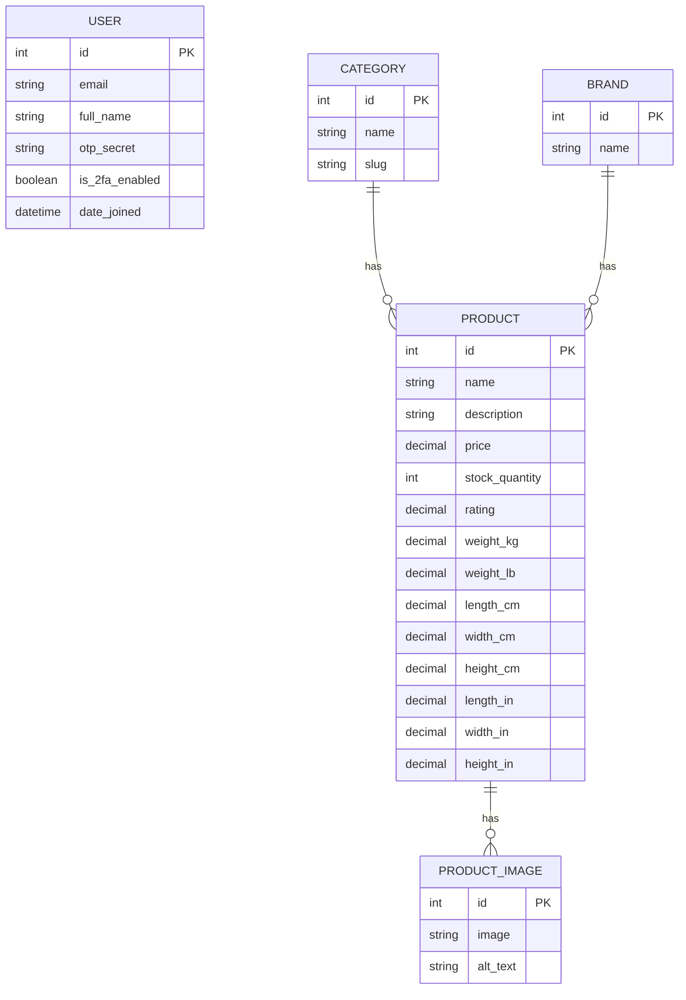

# i-love-shopping (Part 1)

## Overview
Hardware-focused B2C e-commerce foundation. This project covers user accounts and authentication (email + Google OAuth, JWT with refresh rotation, optional 2FA), a searchable product catalog with filters and sorting, and a Dockerized setup.

## ERD
ERD image: `docs/erd.svg`

Mermaid source:



## Setup for OAuth (Google)
1) Go to Google Cloud Console → APIs & Services → Credentials.
2) Create OAuth client ID (Web Application).
3) Authorized JavaScript origins:
   - `http://localhost:8000`
4) Authorized redirect URIs:
   - `http://localhost:8000/api/auth/oauth/google/`
5) Copy Client ID/Secret into `backend/.env`:
   - `GOOGLE_OAUTH_CLIENT_ID=...`
   - `GOOGLE_OAUTH_CLIENT_SECRET=...`
6) In Google Cloud Console, enable the “Google People API” if required.
7) Mini frontend: paste the Client ID into the Google OAuth section to test login.
   - The mini frontend will auto-load it from `/api/auth/oauth/google-client-id/`.
8) Existing accounts can be linked by email (SOCIALACCOUNT_QUERY_EMAIL).
   - Social account adapter will auto-connect existing users by email.

## Password Reset Email
This project uses SMTP. Update these values in `backend/.env`:
```
EMAIL_HOST=smtp.gmail.com
EMAIL_PORT=587
EMAIL_HOST_USER=your-email@gmail.com
EMAIL_HOST_PASSWORD=your-app-password
EMAIL_USE_TLS=1
DEFAULT_FROM_EMAIL=noreply@hardware-shop.test
```
Endpoints:
- `POST /api/auth/password/reset/`
- `POST /api/auth/password/reset/confirm/`

## reCAPTCHA Setup
- Add both keys to `backend/.env`:
  - `RECAPTCHA_SITE_KEY=...`
  - `RECAPTCHA_SECRET_KEY=...`
- Mini frontend auto-loads the site key from `/api/auth/recaptcha-site-key/`.

## Common Setup Issues
- Backend fails on startup: check `.env` values and run migrations.
- OAuth fails: verify redirect URI matches exactly and client ID/secret are correct.
- CAPTCHA fails: ensure `RECAPTCHA_SECRET_KEY` is set (empty key skips validation).
- Docker port 5432 in use: stop local Postgres or change the Docker port mapping.
- docker-compose v1 ContainerConfig error: run `docker-compose down --remove-orphans` and `docker-compose rm -f`.

## Setup Instructions

### Docker (recommended)
1) Copy env template
```
cp backend/envtemplate.txt backend/.env
```
2) Fill in Google OAuth + reCAPTCHA secrets in `backend/.env`.
   - Google OAuth redirect URI: `http://localhost:8000/api/auth/oauth/google/`
   - Allowed JS origins: `http://localhost:8000`
3) Start everything
```
docker-compose up --build
```
4) (Optional) Add sample images:
```
docker-compose exec backend python manage.py add_sample_images
```
5) (Optional) Run mini frontend:
```
cd frontend
python3 -m http.server 8001
```

### Local (without Docker)
1) Create venv and install requirements:
```
cd backend
python3 -m venv venv
source venv/bin/activate
pip install -r requirements.txt
cp envtemplate.txt .env
```
2) Update `.env` values.
3) Migrate and seed:
```
python manage.py migrate
python manage.py seed_catalog
python manage.py runserver
```
4) (Optional) Create admin user:
```
python manage.py createsuperuser
```
5) (Optional) Add sample images:
```
python manage.py add_sample_images
```
6) (Optional) Create demo admin from env (quick testing):
```
DEMO_ADMIN_EMAIL=admin@example.com DEMO_ADMIN_PASSWORD=AdminPass123! \\
python manage.py create_demo_admin
```
7) (Optional) Run mini frontend:
```
cd frontend
python3 -m http.server 8001
```
8) (Optional) Cleanup expired access token blocks:
```
python manage.py cleanup_access_tokens
```

## Usage Guide
- API base: `http://localhost:8000/api`
- Demo page: `http://localhost:8000/`
- Mini frontend: `http://localhost:8001/`

### Auth
- Register (with CAPTCHA token): `POST /auth/register/`
- Login (2FA code optional): `POST /auth/login/`
- Refresh (rotation enabled): `POST /auth/token/refresh/`
- Logout (blacklist refresh): `POST /auth/logout/`
- Logout all sessions: `POST /auth/logout-all/`
- Revoke access token: `POST /auth/token/revoke/`
- 2FA setup: `POST /auth/2fa/setup/`
- 2FA verify: `POST /auth/2fa/verify/`
- 2FA disable: `POST /auth/2fa/disable/`
 - Password reset request: `POST /auth/password/reset/`
 - Password reset confirm: `POST /auth/password/reset/confirm/`

Google OAuth:
- `POST /auth/oauth/google/`
  - Body: `{"access_token":"<google-access-token>"}`
- (Optional) Allauth flow: `POST /auth/oauth/google-allauth/`

Password reset endpoints (dj-rest-auth):
- `POST /auth/password/reset/`
- `POST /auth/password/reset/confirm/`

### Catalog
- Product list: `GET /catalog/products/`
- Product detail: `GET /catalog/products/{id}/`
- Categories: `GET /catalog/categories/`
- Brands: `GET /catalog/brands/`
- Suggestions: `GET /catalog/suggest/?q=gpu`
 - Upload image (admin only): `POST /catalog/products/{id}/images/`

Filtering and sorting:
- `GET /catalog/products/?min_price=100&max_price=500&brand=NexCore&category=graphics-cards&rating=4`
- `GET /catalog/products/?ordering=price` (or `-price`, `rating`, `name`)
Invalid filter values return `400`.

Image upload example (admin user required):
```
curl -X POST http://localhost:8000/api/catalog/products/1/images/ \
  -H "Authorization: Bearer <ADMIN_ACCESS_TOKEN>" \
  -F "image=@/path/to/image.png" \
  -F "alt_text=Front view"
```
When `DEBUG=1`, images are served under `http://localhost:8000/media/...`.

## Notes for Review
- JWT access tokens are intended for in-memory storage on the client.
- Refresh token rotation is enabled and old tokens are blacklisted.
- Access tokens can be revoked via the denylist endpoint.
- Optional 2FA uses TOTP (Google Authenticator compatible).

## Search Implementation
- Product search uses DRF search filter on name/description/brand/category fields.
- Faceted filters use `django-filter` with strict validation for price, brand, and category.
- Suggestions are generated by simple name matching for quick feedback.

## Database + ACID Notes
- PostgreSQL provides ACID guarantees for transactional updates.
- Relational tables and foreign keys enforce product/category/brand integrity.
- Index-friendly filters (price, brand, category) support scalable queries.

## Architecture
- API-first Django monolith for Part 1 scope.
- Clean separation by app: `users` for auth, `catalog` for products.

## Compliance Notes
- No payment data stored in Part 1.
- JWT access tokens are short-lived and kept in memory only by the frontend.
- Password reset uses SMTP and avoids exposing user passwords.

## Student Can Explain
- JWT structure (header, payload, signature) and why access tokens are short-lived.
- Refresh token rotation and blacklist approach for token revocation.
- ACID properties and why PostgreSQL is suitable for relational product data.
- Scalability basics: DB indexing, filtering, and pagination with DRF.
- Architecture choice: Django monolith with API-first approach.

## Tests
From `backend/`:
```
python manage.py test
```
Docker:
```
docker-compose exec backend python manage.py test
```

## Test Coverage Map
- Auth: register/login, refresh rotation, logout, logout-all, access token revoke, 2FA validation.
- Catalog: list/detail, filters/sorting, search suggest, categories/brands, image upload permissions.
- Security: invalid filters, malformed inputs, and auth edge cases.

Manual checks (periodic):
- CAPTCHA verification during register (with a real token).
- Google OAuth login flow (client ID + redirect URI).
- 2FA setup + login with TOTP code.

## Reviewer Checklist
- Register user with CAPTCHA token.
- Login and refresh token (verify rotation).
- Enable 2FA, then login with code.
- Logout all sessions.
- Revoke access token.
- List products + filters + ordering.
- Upload a product image as admin.

## Runbook
- Start: `docker-compose up --build`
- Stop: `docker-compose down`
- View logs: `docker-compose logs -f backend`
- Cleanup token blocklist: `docker-compose exec backend python manage.py cleanup_access_tokens`
