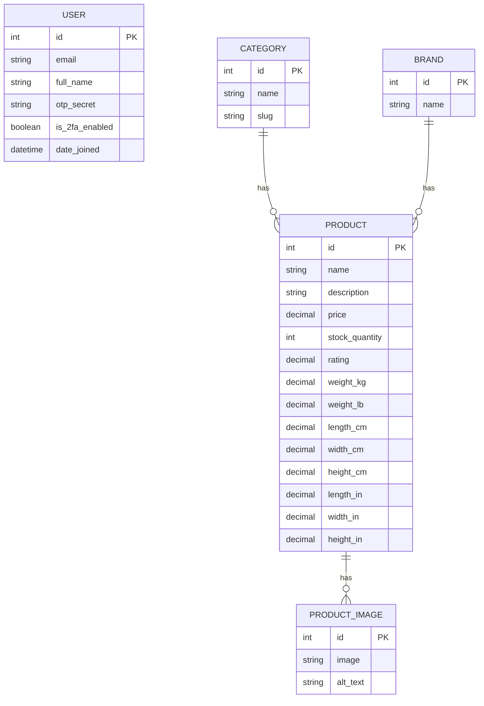
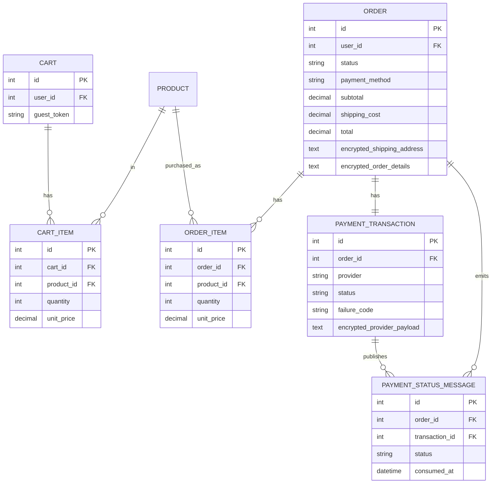

# i-love-shopping (Part 3)

## Overview
This repository contains Part 3 (Experience + Management + Security hardening) of my fullstack e-commerce project for the advanced fullstack specialization.

Main focus areas:
- guest and logged-in carts
- real-time cart quantity updates with instant subtotal recalculation
- single-page checkout
- payment simulation with success/failure scenarios
- order management (status updates, filtering, cancellation)
- review and rating system with helpful voting
- admin management tools (products, categories, users, delivery options, refunds)
- required UI pages (PDP/PLP/search/contact/about/admin/404/order confirmation)
- image handling with generated thumbnail/medium/full-size variants
- security hardening (2FA-gated admin, token bucket rate limiting, TLS-ready reverse proxy)

The project runs as a Django app with Docker support.

## ERD
ERD image: `docs/erd.svg`

Mermaid source:



Commerce extension:



## Tech Stack
- Backend: Django + Django REST Framework
- DB: PostgreSQL (Docker), SQLite (local quick dev)
- Auth: JWT, reCAPTCHA, optional 2FA, Google OAuth
- Payments: Stripe/PayPal-style sandbox simulation
- Containerization: Docker Compose

## Setup

### Docker (recommended)
1. Copy env template:
```bash
cp backend/envtemplate.txt backend/.env
```
2. Fill required values in `backend/.env`:
- `SECRET_KEY`
- `GOOGLE_OAUTH_CLIENT_ID`
- `GOOGLE_OAUTH_CLIENT_SECRET`
- `RECAPTCHA_SECRET_KEY`
- `COMMERCE_ENCRYPTION_KEY` (recommended)
- `USER_DATA_ENCRYPTION_KEY` (recommended, for user PII/2FA secret field encryption)
- `GEOAPIFY_API_KEY` (recommended for strict shipping address verification)
- optional: `ADDRESS_VALIDATION_ENABLED` (default `1`)
- optional: `ADDRESS_VALIDATION_STRICT` (`1` = fail closed if validator is unavailable)
- optional: `ADDRESS_VALIDATION_MIN_CONFIDENCE` (default `0.75`)
- optional: `STRIPE_PUBLISHABLE_KEY`
- optional: `PAYMENT_CALLBACK_SECRET`
3. Start:
```bash
docker-compose up --build
```

### Local (without Docker)
```bash
cd backend
python3 -m venv venv
source venv/bin/activate
pip install -r requirements.txt
cp envtemplate.txt .env
python manage.py migrate
python manage.py seed_catalog
python manage.py runserver
```

## Usage Guide
- App: `http://localhost:8000/`
- API base: `http://localhost:8000/api`
- Key pages:
  - `http://localhost:8000/login/`
  - `http://localhost:8000/register/`
  - `http://localhost:8000/account/`
  - `http://localhost:8000/products/`
  - `http://localhost:8000/products/<id>/`
  - `http://localhost:8000/cart/`
  - `http://localhost:8000/checkout/`
  - `http://localhost:8000/order-confirmation/`
  - `http://localhost:8000/orders/`
  - `http://localhost:8000/search/`
  - `http://localhost:8000/contact/`
  - `http://localhost:8000/about/`
  - `http://localhost:8000/admin-panel/`

### Checkout and Payments (review focus)
- Checkout is single-page.
- Logged-in users get prefill from `/api/commerce/checkout/prefill/`.
- Order summary is available via `/api/commerce/checkout/summary/`.
- Raw card data is never sent to backend.
- Shipping address is validated against city/state/postal/country consistency.

For review, payment outcomes are deterministic through `tok_*` sandbox tokens.

Sandbox tokens:
- `tok_success`
- `tok_fail_insufficient_funds`
- `tok_fail_invalid_card`
- `tok_fail_expired_card`
- `tok_fail_gateway_timeout`

Local sandbox card-to-token mapping (when Stripe Element is not used):
- `4242 4242 4242 4242` -> success
- `4000 0000 0000 0002` -> invalid card
- `4000 0000 0000 9995` -> insufficient funds
- `4000 0000 0000 0069` -> expired card
- `4000 0000 0000 0127` -> gateway timeout

For test cards, use:
- any future expiry
- any 3-digit CVC
- valid ZIP/postal code matching city/state and country

### Cart Behavior
- Cart page updates line totals and subtotal in real time when quantity changes.
- Quantity updates are still synced to backend immediately after (debounced), so server remains source of truth.

### Image Variants
- Product image API returns:
  - `image_thumbnail`
  - `image_medium`
  - `image_full`
- Variants are generated on upload and served from media storage.

### Commerce API Quick Map
Cart:
- `GET /api/commerce/cart/`
- `POST /api/commerce/cart/items/`
- `PATCH /api/commerce/cart/items/{item_id}/`
- `DELETE /api/commerce/cart/items/{item_id}/`

Checkout:
- `GET /api/commerce/checkout/prefill/`
- `GET /api/commerce/checkout/summary/`
- `GET /api/commerce/checkout/payment-config/`
- `POST /api/commerce/checkout/place-order/`

Orders:
- `GET /api/commerce/orders/?status=&date_from=&date_to=&ordering=`
- `GET /api/commerce/orders/{order_id}/`
- `POST /api/commerce/orders/{order_id}/cancel/`
- `POST /api/commerce/orders/{order_id}/process/` (staff)

Supported `ordering` values for orders:
- `created_at`
- `-created_at`
- `status`
- `-status`

Payment callback simulation:
- `POST /api/commerce/payments/callback/`
- optional header: `X-Payment-Callback-Secret`

Part 3 additions:
- `GET/POST /api/catalog/products/{product_id}/reviews/`
- `POST /api/catalog/reviews/{review_id}/helpful/`
- `GET/POST /api/auth/admin/users/` and `/api/auth/admin/users/{id}/role/`
- `GET/POST /api/commerce/admin/delivery-options/`
- `PATCH/DELETE /api/commerce/admin/delivery-options/{id}/`
- `POST /api/commerce/admin/orders/{id}/status/`
- `GET /api/commerce/admin/refunds/`
- `POST /api/commerce/admin/refunds/{id}/status/`
- `GET/POST /api/commerce/refunds/`
- `DELETE /api/catalog/admin/reviews/{id}/`
- `POST /api/catalog/admin/products/bulk-upload/`
- `GET/POST /api/catalog/admin/products/` + `GET/PATCH/DELETE /api/catalog/admin/products/{id}/`
- `GET/POST /api/catalog/admin/categories/` + `GET/PATCH/DELETE /api/catalog/admin/categories/{id}/`
- `POST /api/support/contact/`

## Security and Compliance Notes
- Access tokens are intended for in-memory use.
- Refresh rotation + blacklist are enabled.
- Checkout accepts only tokenized payment values (`tok_*` or `pm_*`).
- User PII (`full_name`) and 2FA secrets are encrypted at rest.
- Order and payment payloads are encrypted at rest.
- Revoked access token identifiers are stored as SHA-256 hashes.
- Stock updates and checkout use transactions/row locks to prevent overselling.
- API token bucket rate limiting is enabled for `/api/*` endpoints.
- Admin endpoints are protected by role + staff + mandatory 2FA checks.

### Token Bucket Rate Limiting
Config (`backend/.env`):
```env
RATE_LIMIT_ENABLED=1
RATE_LIMIT_CAPACITY=120
RATE_LIMIT_REFILL_RATE=2.0
```
- Capacity = max burst tokens per client bucket.
- Refill rate = tokens/second.
- Returns `429` with `Retry-After` when bucket is empty.

### TLS (Self-Signed, local demo)
1. Generate cert:
```bash
./ops/tls/generate_self_signed_cert.sh
```
2. Start stack with TLS reverse proxy profile:
```bash
docker-compose --profile tls up --build
```
3. Access:
- `https://localhost:8443/` (TLS)
- `http://localhost:8080/` (redirects to HTTPS)

Optional secure-cookie/HSTS envs:
```env
SECURE_SSL_REDIRECT=0
SESSION_COOKIE_SECURE=0
CSRF_COOKIE_SECURE=0
SECURE_HSTS_SECONDS=0
```

Recommended hardened review profile (when running behind TLS):
```env
SECURE_MODE=1
SECURE_SSL_REDIRECT=1
SESSION_COOKIE_SECURE=1
CSRF_COOKIE_SECURE=1
CSRF_COOKIE_HTTPONLY=1
SESSION_COOKIE_SAMESITE=Lax
CSRF_COOKIE_SAMESITE=Lax
SESSION_ENGINE=django.contrib.sessions.backends.signed_cookies
SECURE_HSTS_SECONDS=31536000
```

Notes:
- `SECURE_MODE=1` forces secure redirect + secure cookies + strong HSTS defaults.
- Signed-cookie session engine avoids storing session payloads in the database.

### PCI DSS (short explanation)
PCI DSS means card data must be handled securely. In practice for this project:
- no raw PAN/CVV is stored on the backend
- tokenized payment flow is used
- sensitive order/payment payloads are encrypted at rest

## Authentication Setup Notes
### Google OAuth
In Google Cloud Console configure:
- JS origin: `http://localhost:8000`
- Redirect URIs:
  - `http://localhost:8000`
  - `http://localhost:8000/api/auth/oauth/google/`

### reCAPTCHA
Set in `backend/.env`:
- `RECAPTCHA_SITE_KEY`
- `RECAPTCHA_SECRET_KEY`

### Shipping Address Validation (Geoapify)
Set in `backend/.env`:
- `GEOAPIFY_API_KEY=...`
- `ADDRESS_VALIDATION_ENABLED=1`
- `ADDRESS_VALIDATION_STRICT=1`
- `ADDRESS_VALIDATION_MIN_CONFIDENCE=0.75`

Notes:
- With `ADDRESS_VALIDATION_STRICT=1`, checkout is blocked if the address validation service is unavailable.
- With `ADDRESS_VALIDATION_STRICT=0`, checkout falls back to local sanity checks if the external validator is unavailable.

### SMTP (password reset + checkout notifications)
```env
EMAIL_BACKEND=django.core.mail.backends.smtp.EmailBackend
EMAIL_HOST=smtp.gmail.com
EMAIL_PORT=587
EMAIL_HOST_USER=your-email@gmail.com
EMAIL_HOST_PASSWORD=your-app-password
EMAIL_USE_TLS=1
DEFAULT_FROM_EMAIL=noreply@hardware-shop.test
```

If you use console email backend, messages are printed to logs instead of real inboxes.

## Tests
Run all tests from Docker:
```bash
docker-compose exec -T backend python manage.py test -v 2
```

Run locally:
```bash
cd backend
python manage.py test
```

Current automated coverage includes:
- auth flows (register/login/logout/2FA/token rotation)
- catalog filtering/ordering/security checks
- commerce cart/checkout/order/callback/inventory flows
- payment failure scenario handling
- admin part 3 APIs (roles, delivery options, refunds, moderation, bulk upload, CRUD)
- required part 3 pages and support form
- rate limiting behavior

## Load Testing
Load test scripts are included under `loadtests/k6/`:
- `browse_catalog.js`
- `search_and_pdp.js`
- `cart_checkout.js`

Run examples:
```bash
k6 run loadtests/k6/browse_catalog.js
k6 run loadtests/k6/search_and_pdp.js
k6 run loadtests/k6/cart_checkout.js
```

Run all scenarios with Docker (no local k6 install):
```bash
docker-compose --profile loadtest run --rm k6
```

If app runs behind TLS proxy:
```bash
BASE_URL=https://localhost:8443 k6 run loadtests/k6/browse_catalog.js
```

### Performance Analysis Report
Test date: 2026-02-26  
Environment: Docker Compose (`backend` + `postgres`) with local k6 container.

Objectives:
- p90 < 2s
- >=50 concurrent users
- >=10 transactions/s
- >=98% success
- <5% error rate

Scenario results:

1. `browse_catalog.js` (50 VUs, 60s)
- p90 latency: `77.19ms`
- p95 latency: `91.24ms`
- throughput: `43.93 req/s`
- error rate: `0.00%`
- status: Passed objective targets for latency/error at 50 concurrent users.

2. `search_and_pdp.js` (40 VUs, 60s)
- p90 latency: `65.88ms`
- p95 latency: `74.38ms`
- throughput: `70.38 req/s`
- error rate: `0.00%`
- status: Passed objective targets for latency/error.

3. `cart_checkout.js` (20 VUs, 60s)
- p90 latency: `2.65s`
- p95 latency: `4.21s`
- throughput: `10.92 req/s`
- error rate: `50.00%`
- status: Throughput target met, but success/error objective failed under sustained checkout concurrency.

Identified limits and bottlenecks:
- Maximum stable concurrency before checkout reliability degradation in this environment: around `20 VUs` for cart+checkout flow.
- At this load, some requests exceeded `5s` (max observed `5.77s`), indicating pressure in transactional checkout path.
- Main bottleneck area: checkout/payment/order write path (stock lock + order creation + payment simulation + notification path).
- Optimization options:
  - decouple non-critical notification work from synchronous checkout response
  - reduce lock scope/duration in checkout transaction path
  - move callback/payment simulation processing to async worker for peak periods
  - tune DB connection pool and add endpoint-specific rate-limit tiers for checkout

Resource profiling (Docker stats sampled during load runs):
- `browse_catalog` run max observed backend/db CPU: `40.75%`, memory: `0.92%`
- `cart_checkout` run max observed backend/db CPU: `18.49%`, memory: `0.95%`
- Based on tested scenarios, CPU/memory >90% threshold was **not reached** in this environment.
- Profiling artifacts are stored in `docs/perf/`.

## Manual QA (Commerce)
1. Add/update/remove cart items and verify totals.
2. Verify guest cart persistence with `X-Guest-Cart-Token`.
3. Verify logged-in cart persistence.
4. Checkout success with `tok_success`.
5. Checkout failures with all `tok_fail_*` cases.
6. Validate callback secret behavior (`403` without secret, success with secret).
7. Validate terminal state guard (`409` on invalid regression).
8. Process paid order as staff, verify cancellation is blocked afterwards.

## Mandatory Criteria Mapping
- Reviews + average rating + helpful sorting:
  - `backend/catalog/models.py`
  - `backend/catalog/views.py`
  - `backend/catalog/serializers.py`
  - tests: `backend/tests/test_catalog.py`
- 2FA enforcement for admin accounts:
  - `backend/users/serializers.py`
  - `backend/users/permissions.py`
  - tests: `backend/tests/test_admin_part3.py`
- Admin CRUD (products/categories/orders/refunds/users), delivery options, review moderation, bulk upload:
  - `backend/catalog/views.py`
  - `backend/commerce/views.py`
  - `backend/users/views.py`
  - `backend/static/admin_panel.js`
  - tests: `backend/tests/test_admin_part3.py`
- Required pages (home, PLP, PDP, cart, checkout, order confirmation, account, search, admin, contact, about, 404):
  - `backend/config/urls.py`
  - `backend/templates/*.html`
  - tests: `backend/tests/test_part3_pages.py`
- Search/filter/sort/pagination and grid/list support:
  - `backend/static/product_list.js`
  - `backend/static/search.js`
- Home featured products + collections:
  - `backend/static/home.js`
  - `backend/templates/index.html`
- Product image multi-size storage/serving:
  - `backend/catalog/models.py`
  - `backend/catalog/serializers.py`
  - tests: `backend/tests/test_catalog.py`
- Security requirements (token bucket, input validation, tokenized payments, encryption at rest, TLS local setup):
  - `backend/config/middleware.py`
  - `backend/commerce/serializers.py`
  - `backend/commerce/services.py`
  - `ops/nginx/default.conf`
  - `ops/tls/generate_self_signed_cert.sh`
  - tests: `backend/tests/test_security.py`, `backend/tests/test_commerce.py`

## Review Explanations (Short)
- CIA principles in this project:
  - Confidentiality: user PII/2FA secrets and sensitive order/payment payloads are encrypted at rest, payment data is tokenized, and revoked token IDs are hashed.
  - Integrity: transactional checkout + row locks + controlled order status transitions prevent inconsistent writes.
  - Availability: rate limiting reduces abuse impact, and Dockerized deployment keeps environment reproducible.
- Semantic HTML and accessibility approach:
  - pages use semantic containers (`header`, `main`, headings) with skip links and keyboard-focusable controls.
  - meaningful text alternatives are provided for product imagery through `alt` values and structured sections.
- Testing approach:
  - unit/API/security/user-flow tests are run continuously in Docker (`90` automated tests currently passing).
  - manual QA checklist is kept in README for review-time end-to-end demonstrations.

## Review Demo Flow (10-15 min)
1. Home + PLP + PDP: open `/`, `/products/`, `/products/<id>/`, show ratings/reviews/helpful votes.
2. Cart + checkout: add product, modify quantity, show real-time totals and checkout validation.
3. Payment outcomes: run one success (`tok_success`) and one failure (`tok_fail_*`).
4. Order lifecycle: show `/orders/`, then admin updates order status from `/admin-panel/`.
5. Admin controls: CRUD category/product, update user role, manage delivery option, moderation delete review, bulk upload JSON.
6. Security: show admin 2FA requirement, demonstrate rate limit (`429`) with repeated API calls, show TLS profile startup command.
7. Testing proof: run `docker-compose exec -T backend python manage.py test -v 2`.

## Reviewer Checklist
- README includes overview, ERD, setup, and usage.
- Guest and persistent cart behavior can be demonstrated.
- Checkout prefill, summary, and payment outcomes can be demonstrated.
- Required payment failure scenarios can be reproduced.
- Callback updates order status correctly.
- Order filtering/detail/cancel behavior can be shown.
- Encryption-at-rest fields exist for order/payment payloads.
- Tests run successfully.
- Dockerized setup runs with one command.

## Runbook
Start:
```bash
docker-compose up --build
```
Stop:
```bash
docker-compose down
```
Logs:
```bash
docker-compose logs -f backend
```
Cleanup access-token blocklist:
```bash
docker-compose exec backend python manage.py cleanup_access_tokens
```

## Common Troubleshooting
- OAuth `redirect_uri_mismatch`: check exact redirect URIs and wait for propagation.
- CAPTCHA failures: confirm `RECAPTCHA_SECRET_KEY` is set.
- Docker port conflicts: stop local Postgres or change port mapping.
- Callback unauthorized: if `PAYMENT_CALLBACK_SECRET` is set, send matching header.
