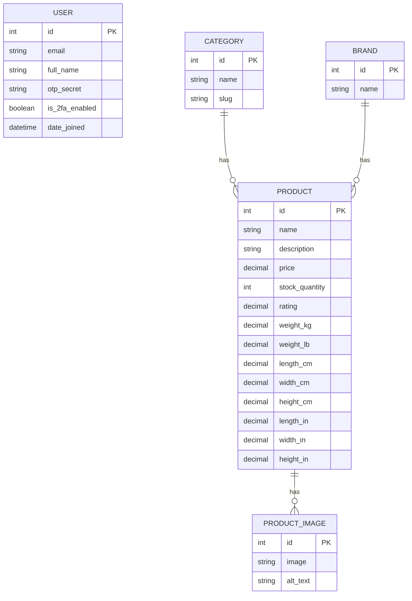
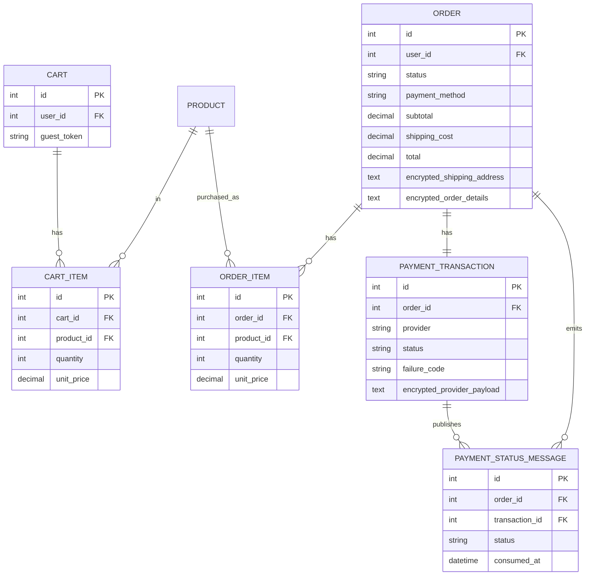

# i-love-shopping (Part 2)

## Overview
This is the Commerce part of my fullstack e-commerce project for the advanced fullstack specialization.

In this part I focused on:
- guest and logged-in carts
- single-page checkout
- payment simulation with success/failure scenarios
- order management (status updates, filtering, cancellation)
- security basics for payment handling and data encryption

The project runs as a Django app with Docker support.

## ERD
ERD image: `docs/erd.svg`

Mermaid source:



Commerce extension:



## Tech Stack
- Backend: Django + Django REST Framework
- DB: PostgreSQL (Docker), SQLite (local quick dev)
- Auth: JWT, reCAPTCHA, optional 2FA, Google OAuth
- Payments: Stripe/PayPal-style sandbox simulation
- Containerization: Docker Compose

## Setup

### Docker (recommended)
1. Copy env template:
```bash
cp backend/envtemplate.txt backend/.env
```
2. Fill required values in `backend/.env`:
- `SECRET_KEY`
- `GOOGLE_OAUTH_CLIENT_ID`
- `GOOGLE_OAUTH_CLIENT_SECRET`
- `RECAPTCHA_SECRET_KEY`
- `COMMERCE_ENCRYPTION_KEY` (recommended)
- optional: `STRIPE_PUBLISHABLE_KEY`
- optional: `PAYMENT_CALLBACK_SECRET`
3. Start:
```bash
docker-compose up --build
```

### Local (without Docker)
```bash
cd backend
python3 -m venv venv
source venv/bin/activate
pip install -r requirements.txt
cp envtemplate.txt .env
python manage.py migrate
python manage.py seed_catalog
python manage.py runserver
```

## Usage Guide
- App: `http://localhost:8000/`
- API base: `http://localhost:8000/api`
- Key pages:
  - `http://localhost:8000/login/`
  - `http://localhost:8000/register/`
  - `http://localhost:8000/account/`
  - `http://localhost:8000/cart/`
  - `http://localhost:8000/checkout/`
  - `http://localhost:8000/orders/`

### Checkout and Payments (review focus)
- Checkout is single-page.
- Logged-in users get prefill from `/api/commerce/checkout/prefill/`.
- Order summary is available via `/api/commerce/checkout/summary/`.
- Raw card data is never sent to backend.

For review, payment outcomes are deterministic through `tok_*` sandbox tokens.

Sandbox tokens:
- `tok_success`
- `tok_fail_insufficient_funds`
- `tok_fail_invalid_card`
- `tok_fail_expired_card`
- `tok_fail_gateway_timeout`

Local sandbox card-to-token mapping (when Stripe Element is not used):
- `4242 4242 4242 4242` -> success
- `4000 0000 0000 0002` -> invalid card
- `4000 0000 0000 9995` -> insufficient funds
- `4000 0000 0000 0069` -> expired card
- `4000 0000 0000 0127` -> gateway timeout

For test cards, use:
- any future expiry
- any 3-digit CVC
- any ZIP/postal code

### Commerce API Quick Map
Cart:
- `GET /api/commerce/cart/`
- `POST /api/commerce/cart/items/`
- `PATCH /api/commerce/cart/items/{item_id}/`
- `DELETE /api/commerce/cart/items/{item_id}/`

Checkout:
- `GET /api/commerce/checkout/prefill/`
- `GET /api/commerce/checkout/summary/`
- `GET /api/commerce/checkout/payment-config/`
- `POST /api/commerce/checkout/place-order/`

Orders:
- `GET /api/commerce/orders/?status=&date_from=&date_to=&ordering=`
- `GET /api/commerce/orders/{order_id}/`
- `POST /api/commerce/orders/{order_id}/cancel/`
- `POST /api/commerce/orders/{order_id}/process/` (staff)

Supported `ordering` values for orders:
- `created_at`
- `-created_at`
- `status`
- `-status`

Payment callback simulation:
- `POST /api/commerce/payments/callback/`
- optional header: `X-Payment-Callback-Secret`

## Security and Compliance Notes
- Access tokens are intended for in-memory use.
- Refresh rotation + blacklist are enabled.
- Checkout accepts only tokenized payment values (`tok_*` or `pm_*`).
- Order and payment payloads are encrypted at rest.
- Stock updates and checkout use transactions/row locks to prevent overselling.

### PCI DSS (short explanation)
PCI DSS means card data must be handled securely. In practice for this project:
- no raw PAN/CVV is stored on the backend
- tokenized payment flow is used
- sensitive order/payment payloads are encrypted at rest

## Authentication Setup Notes
### Google OAuth
In Google Cloud Console configure:
- JS origin: `http://localhost:8000`
- Redirect URIs:
  - `http://localhost:8000`
  - `http://localhost:8000/api/auth/oauth/google/`

### reCAPTCHA
Set in `backend/.env`:
- `RECAPTCHA_SITE_KEY`
- `RECAPTCHA_SECRET_KEY`

### SMTP (password reset + checkout notifications)
```env
EMAIL_BACKEND=django.core.mail.backends.smtp.EmailBackend
EMAIL_HOST=smtp.gmail.com
EMAIL_PORT=587
EMAIL_HOST_USER=your-email@gmail.com
EMAIL_HOST_PASSWORD=your-app-password
EMAIL_USE_TLS=1
DEFAULT_FROM_EMAIL=noreply@hardware-shop.test
```

If you use console email backend, messages are printed to logs instead of real inboxes.

## Tests
Run all tests from Docker:
```bash
docker-compose exec -T backend python manage.py test -v 2
```

Run locally:
```bash
cd backend
python manage.py test
```

Current automated coverage includes:
- auth flows (register/login/logout/2FA/token rotation)
- catalog filtering/ordering/security checks
- commerce cart/checkout/order/callback/inventory flows
- payment failure scenario handling

## Manual QA (Commerce)
1. Add/update/remove cart items and verify totals.
2. Verify guest cart persistence with `X-Guest-Cart-Token`.
3. Verify logged-in cart persistence.
4. Checkout success with `tok_success`.
5. Checkout failures with all `tok_fail_*` cases.
6. Validate callback secret behavior (`403` without secret, success with secret).
7. Validate terminal state guard (`409` on invalid regression).
8. Process paid order as staff, verify cancellation is blocked afterwards.

## Reviewer Checklist
- README includes overview, ERD, setup, and usage.
- Guest and persistent cart behavior can be demonstrated.
- Checkout prefill, summary, and payment outcomes can be demonstrated.
- Required payment failure scenarios can be reproduced.
- Callback updates order status correctly.
- Order filtering/detail/cancel behavior can be shown.
- Encryption-at-rest fields exist for order/payment payloads.
- Tests run successfully.
- Dockerized setup runs with one command.

## Runbook
Start:
```bash
docker-compose up --build
```
Stop:
```bash
docker-compose down
```
Logs:
```bash
docker-compose logs -f backend
```
Cleanup access-token blocklist:
```bash
docker-compose exec backend python manage.py cleanup_access_tokens
```

## Common Troubleshooting
- OAuth `redirect_uri_mismatch`: check exact redirect URIs and wait for propagation.
- CAPTCHA failures: confirm `RECAPTCHA_SECRET_KEY` is set.
- Docker port conflicts: stop local Postgres or change port mapping.
- Callback unauthorized: if `PAYMENT_CALLBACK_SECRET` is set, send matching header.
